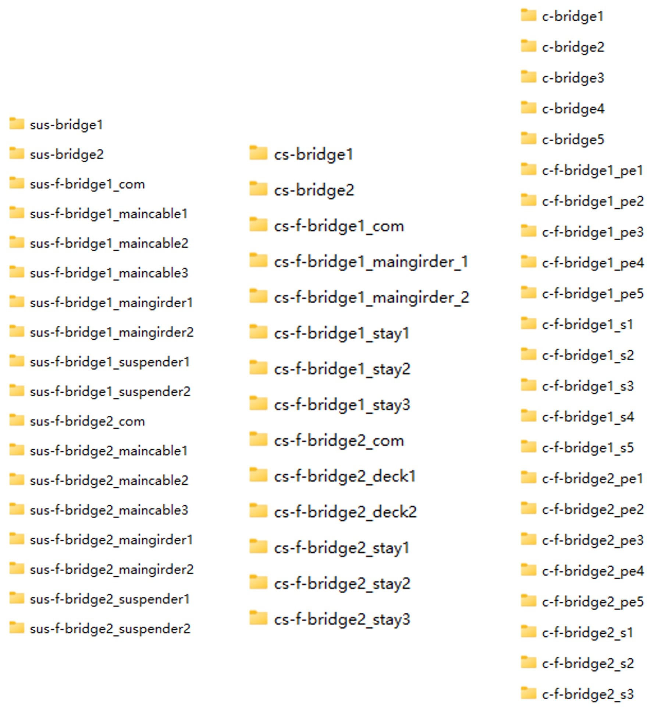

# A Bridge Point Cloud Databank for Digital Bridge Understanding
Created by Hongwei Zhang, Yanjie Zhu, Wen Xiong and C.S. Cai from Southeast University

 Figure 1.  (a) virtual PCD of different completeness; (b) Panorama of BrPCD. (virtual point clouds are partially displayed). 

## Abstract
Despite progress in automated bridge point cloud segmentation based on deep learning, challenges persist. For instance, the absence of a public point cloud dataset specifically designed for bridge instances, and the existing bridge point cloud datasets display a lack of diversity in bridge types and inconsistency in component labeling. These factors may hinder the further improvement of accuracy in bridge point cloud segmentation. In this paper, a universal multi-type bridge point cloud databank, named BrPCD, consisting of a total of 98 point cloud data (10 of them are obtained from scanning and the rest is obtained by data augmentation) from small to long-span bridges, is established. Additionally, a method for augmenting bridge point cloud data is proposed, significantly enriching the spatial feature information of bridges within the dataset. Furthermore, based on the introduced data annotation rules, a uniform categorization of semantic labels for bridge components is implemented, enhancing the applicability of our dataset across various semantic segmentation tasks for different types of bridges. A benchmark testing was conducted on the BrPCD using the PointNet model. The segmentation results indicate that the parameters learned through the BrPCD enable accurate segmentation at the level of various types of bridge components. In other words, the BrPCD can function as a universal dataset, applicable for testing various networks aimed at bridge point cloud segmentation.

## BrPCD download
We provide a download link for BrPCD at *<a href="https://drive.google.com/drive/folders/1hoV1DeMOxDDwcQd7nwWBLmElzHuWlXk8?usp=sharing" target="_blank">Google Drive</a>*, containing three compressed folders, each representing a different bridge type: suspension bridges, cable-stayed bridges, and girder bridges. Within each folder, the complete point cloud data for each individual bridge can be found in separate subfolders. Each bridge point cloud has been annotated with distinct labels according to its bridge components. These labels are stored in further subfolders at the next level.

 

 Figure 2. folders of 3 bridge types . 

 Figure 3. folders of individual bridge . 

 

 Figure 4. files of labels . 

## Explaination of file names
Taking the cable-stayed bridge in Figure 3 as an example, the naming convention for each individual bridge folder is as follows:
* `cs` indicates the bridge type as a cable-stayed bridge.
* `cs-bridge` represents the real bridge point cloud.
* `cs-f-bridge` represents the virtual bridge point cloud.
* The suffix `com` indicates a complete virtual point cloud.
* The suffixes `maingirder+x`, `stay+x`, and `deck+x` represent virtual point clouds where artificial defects have been introduced in different parts of the specified component.

The naming conventions of the suspension bridge folders follows the same rules as described above.

The naming conventions for files within the girder bridge folder are as follows: 
* `c-bridge` denotes the point cloud of a real continuous girder bridge. `s-bridge` denotes the point cloud of a real simply supported girder bridge. 
* `c/s-f-bridge` represents the virtual point cloud for either a continuous or simply supported girder bridge.
* suffixes provide more specific modifications: `pe` indicates changes to the planar extension method of the real bridge, `le` represents alterations in the longitudinal extension, `s` indicates the span length of the real bridge.
## Citation
If you find our work useful in your research, please consider citing:
    
    @article{Hongwei2024abridge,
    	title={A Bridge Point Cloud Databank for Digital Bridge Understanding},
    	author={Hongwei Zhang and Yanjie Zhu and Wen Xiong and C.S. Cai},
    	journal={Computer-Aided Civil and Infrastructure Engineering},
    	year={2024}
    }

